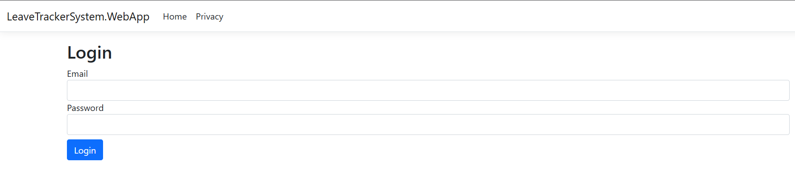
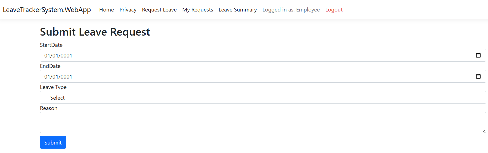
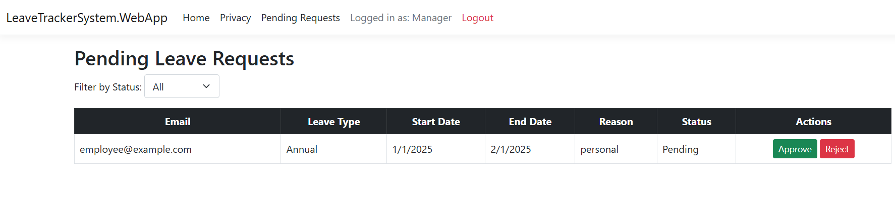
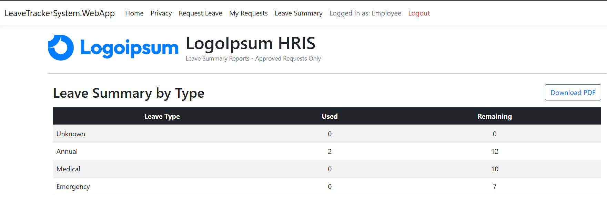
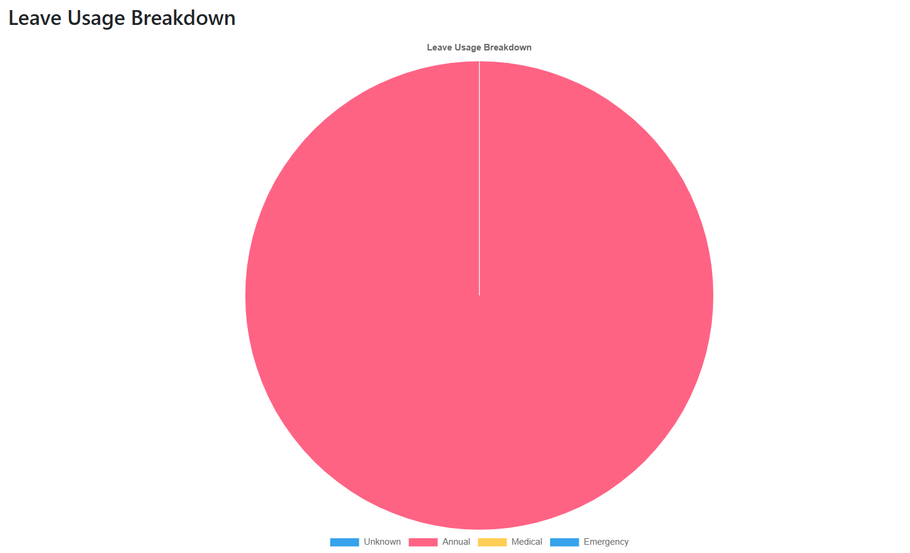
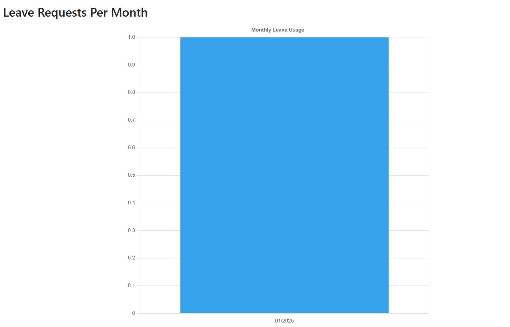
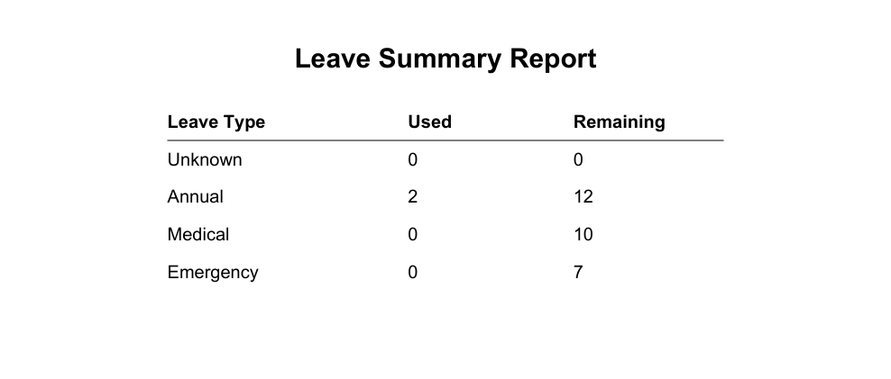

# 🗂️ Leave Tracker System (C#.NET MVC | Onion Architecture)

A full-stack Leave Management System for employees, managers, and admins — built using ASP.NET Core MVC with Onion Architecture.

Features secure role-based login, leave request and approval workflows, visual reporting, PDF export, and test coverage.

Ideal for HR use cases and internal employee self-service portals.

---

## 🧠 Features

- 🧑‍💼 Role-based login: Admin, Manager, Employee
- 🔐 Secure login + role redirect + session timeout
- 📝 Leave request with balance validation
- ✅ Manager approval or rejection with confirmation
- 🗂️ Admin access to all leave records with search/filter
- 📊 Leave balance summary via Chart.js (Pie + Bar)
- 🖨️ Export summary PDF (via PdfSharpCore)
- 🧪 Manual test cases + xUnit test coverage

---

## 🧱 Architecture

Follows **Onion Architecture**:

- `Domain` – Core models, enums, and interfaces
- `Application` – Business logic, services
- `Infrastructure` – In-memory (and future MSSQL) repositories, PDF logic
- `WebApp` – ASP.NET MVC with Razor views, ViewModels, controllers
- `Testing` – Unit tests using xUnit + FluentAssertions

---

## 🧩 Flowcharts

- [Login Flow v1.1](docs/flowcharts/LoginFlow_v1.1.png)  
  → Includes session timeout logic
- [Employee Leave Request Flow v1.0](docs/flowcharts/EmployeeLeaveFlow_v1.0.png)
- [Manager Approval Flow v1.0](docs/flowcharts/ManagerFlow_v1.0.png)
- [Admin Leave Management Flow v1.0](docs/flowcharts/AdminFlow_v1.0.png)

---

## 🗃️ ERD

- [LeaveTracker_ERD_v1.0](docs/erd/LeaveTracker_ERD_v1.0.png)

---

## 🖼️ Screenshots

> Preview of major UI pages and reporting features:









---

## 🧪 Testing

- Manual Tests: See [`ManualTests_v1.0.md`](docs/test-cases/ManualTests_v1.0.md)
- xUnit Tests: `Testing/LeaveBalanceServiceTests.cs`

Run all tests with:
```bash
dotnet test
