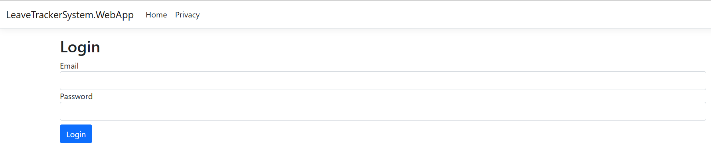
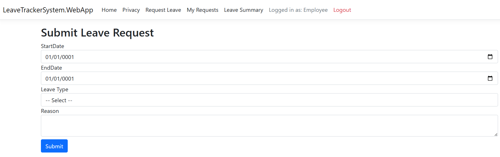
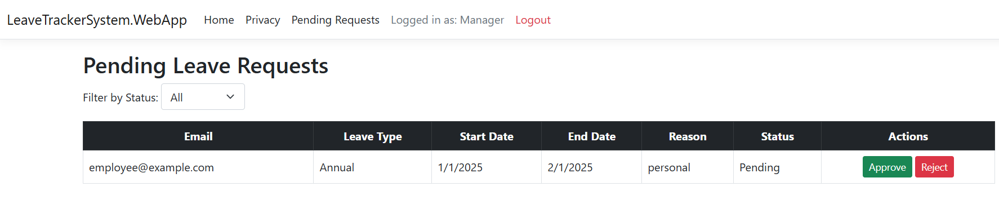
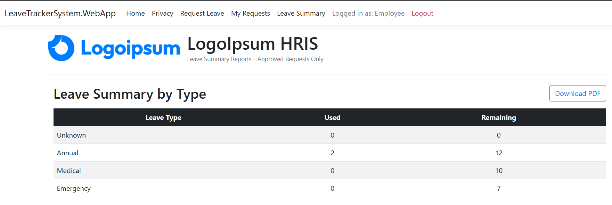
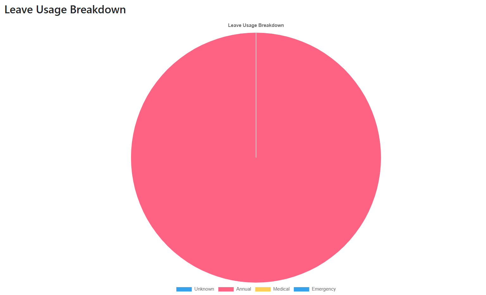
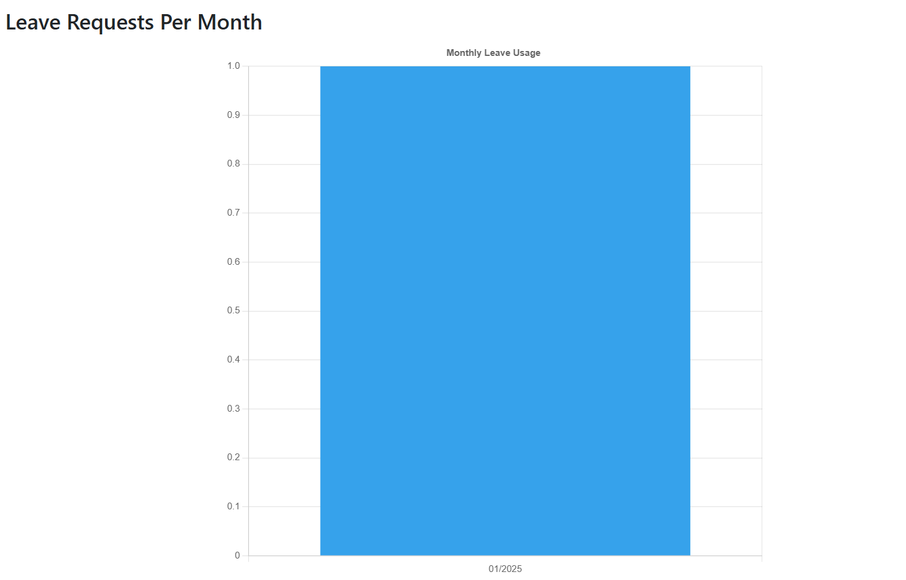
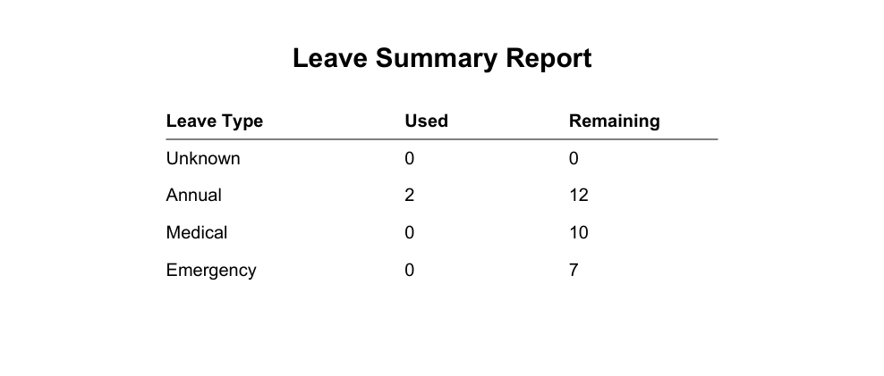

# 🗂️ Leave Tracker System (ASP.NET Core MVC | Onion Architecture)

A role-based Leave Management System built with ASP.NET Core MVC following Onion Architecture.

The system simulates an internal enterprise HR workflow where employees can submit leave requests, managers approve or reject requests, and administrators monitor leave records.

Includes reporting dashboards, PDF export, and unit testing.

---

## 🧠 Features

- 🧑‍💼 Role-based access: Admin, Manager, Employee
- 🔐 Secure login with role-based redirect and session timeout handling
- 📝 Leave request submission with leave balance validation
- ✅ Manager approval or rejection workflow
- 🗂️ Admin view of all leave records with filtering
- 📊 Leave usage dashboards using Chart.js (Pie + Bar)
- 🖨️ Export leave summary to PDF using PdfSharpCore
- 🧪 Unit testing using xUnit and FluentAssertions

---

## 🔄 System Workflow

The system follows a simple role-based workflow:

**Employee**

1. Submit leave request
2. System validates leave balance
3. Request status set to **Pending**

**Manager**

1. Review employee leave requests
2. Approve or reject requests
3. Status updated to **Approved** or **Rejected**

**Admin**

1. View all leave requests across the system
2. Monitor leave usage and reporting dashboards
3. Access summary charts and records

This workflow ensures leave requests follow a controlled approval process before being finalized.

---

## 🧰 Tech Stack

- ASP.NET Core MVC
- C#
- Entity Framework Core
- SQL Server
- Chart.js
- PdfSharpCore
- xUnit + FluentAssertions

---

## 🧱 Architecture

The system follows **Onion Architecture** to separate concerns:

- `Domain` – Entities, enums, and core domain models
- `Application` – Business logic services and DTOs
- `Infrastructure` – EF Core repositories, persistence, and external services
- `WebApp` – ASP.NET Core MVC controllers, Razor views, ViewModels
- `Testing` – Unit tests using xUnit and FluentAssertions

---

## 🧩 Flowcharts

- [Login Flow v1.1](docs/flowcharts/LoginFlow_v1.1.png)  
- [Employee Leave Request Flow v1.0](docs/flowcharts/EmployeeLeaveFlow_v1.0.png)
- [Manager Approval Flow v1.0](docs/flowcharts/ManagerFlow_v1.0.png)
- [Admin Leave Management Flow v1.0](docs/flowcharts/AdminFlow_v1.0.png)

---

## 🗃️ ERD

- [LeaveTracker_ERD_v1.0](docs/erd/LeaveTracker_ERD_v1.0.png)

---

## 🖼️ Screenshots

Preview of major UI pages and reporting features.









---

## 🧪 Testing

- Manual Test Cases 
  [Manual Test Cases](docs/test-cases/ManualTests_v1.0.md)

- Unit Tests
  Located in `Testing/` project

Run tests:

```bash
dotnet test
```

---

## 📌 Project Status

Final bugfix pass completed and core workflow verified.
System ready for deployment preparation.