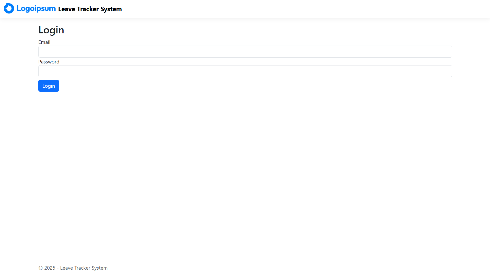
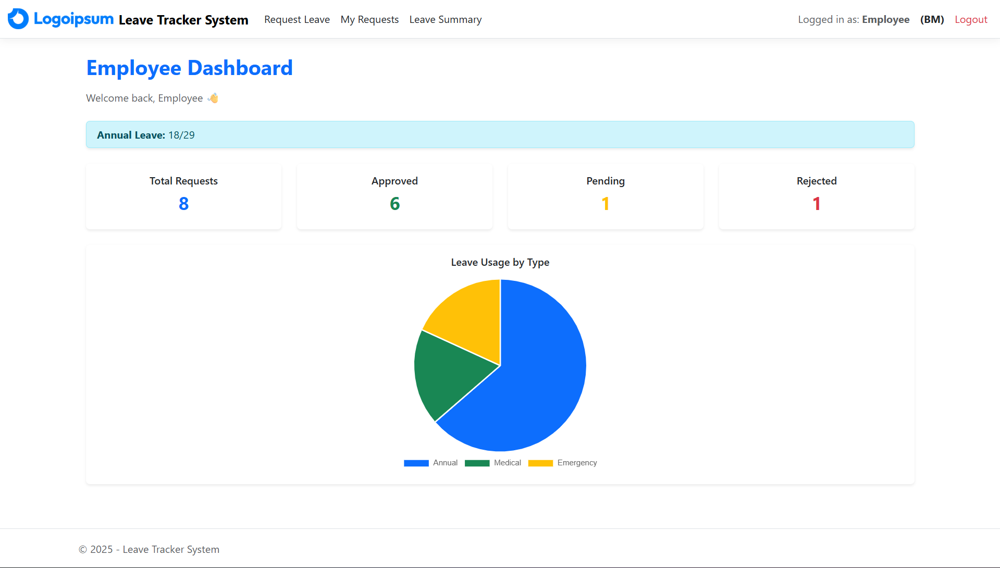
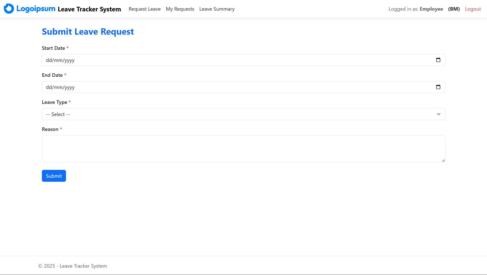
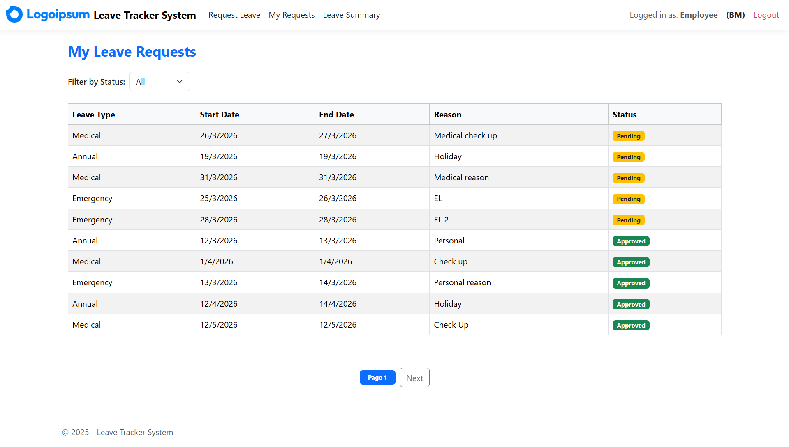
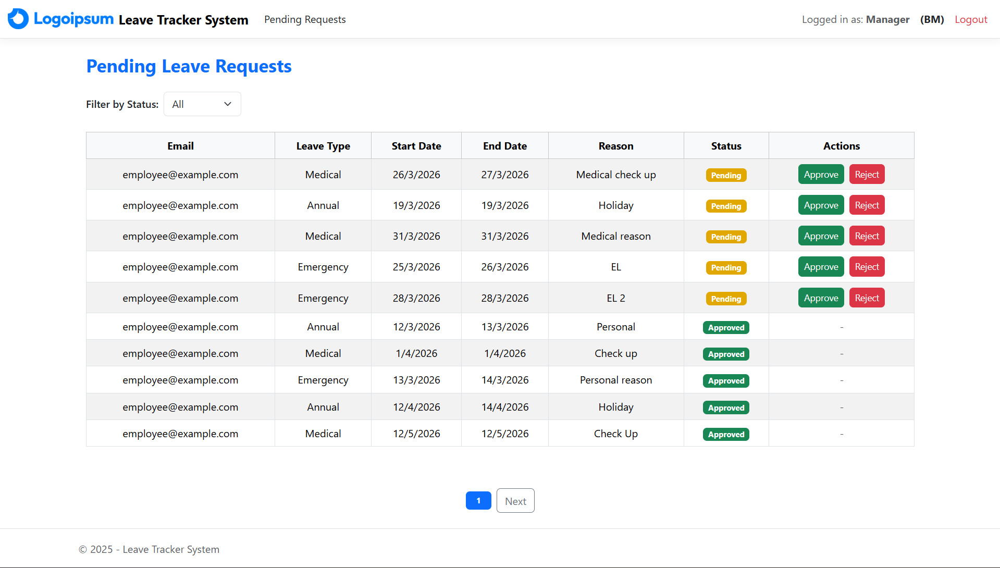
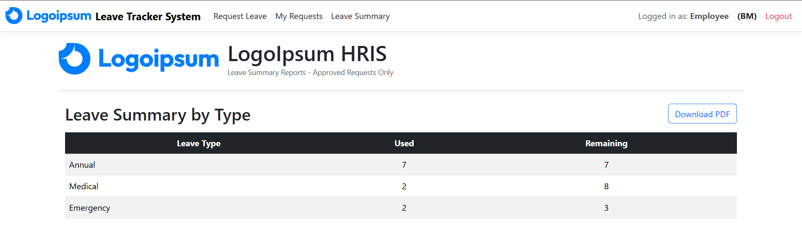
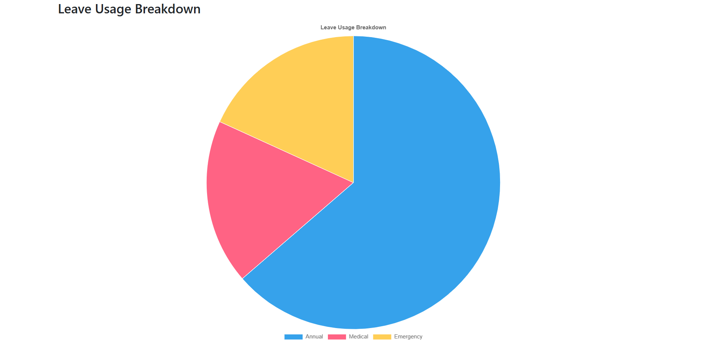
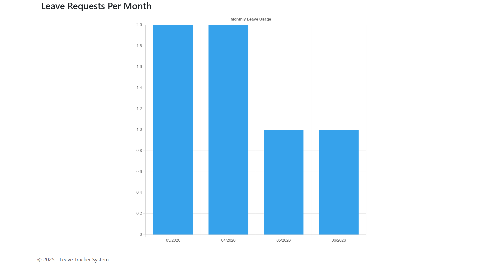
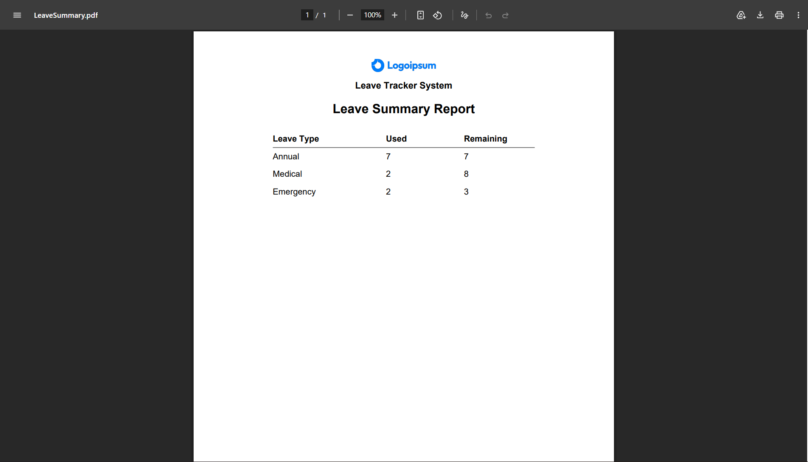

# 🗂️ Leave Tracker System 
**ASP.NET Core MVC | REST API | Onion Architecture**

A role-based Leave Management System built with **ASP.NET Core MVC** following **Onion Architecture** principles.

The system simulates an internal enterprise HR workflow where employees submit leave requests, managers review and approve or reject requests, and administrators monitor leave records.

The project demonstrates several backend engineering practices including **layered architecture, REST APIs, logging, middleware, reporting dashboards, PDF export, and unit testing**.

---

## 🧠 Key Features

### Role-Based Workflow
- 🧑‍💼 Role-based access: **Admin, Manager, Employee**
- 🔐 Session-based authentication using ASP.NET Core session
- ⏱ Session timeout handling with automatic login redirect

### Leave Management
- 📝 Employee leave request submission
- 🔍 Leave balance validation
- ⚙️ Business rule validation for leave duration and entitlement
- ✅ Manager approval / rejection workflow
- 🗂 Admin overview of all leave records

### Reporting & Export
- 📊 Leave usage dashboards using **Chart.js**
- 🥧 Pie chart for leave type distribution
- 📈 Monthly leave usage bar chart
- 🖨 Export leave summary to PDF using **PdfSharpCore**

### Backend Engineering Practices
- 🧱 **Onion Architecture**
- 🔗 **Repository Pattern**
- ⚙️ **Service Layer**
- 📄 **REST API with Swagger**
- 📑 **Pagination for large datasets**
- 🪵 **Structured logging using Serilog**
- 🚨 **Global exception middleware**
- 📡 **Request logging middleware**
- 🧪 **Unit testing using xUnit and FluentAssertions**
- 📦 Dependency Injection across application layers

---

## 🔄 System Workflow

The system follows a structured approval workflow.

## Employee

1. Submit leave request
2. System validates leave balance
3. Request status set to **Pending**

## Manager

1. Review employee leave requests
2. Approve or reject requests
3. Request status updated to **Approved** or **Rejected**

## Admin

1. View all leave requests
2. Monitor system-wide leave usage
3. Access reporting dashboards and records

This ensures leave requests follow a **controlled approval process before being finalized**.

---

## 🧰 Tech Stack

### Backend
- .NET 8
- ASP.NET Core MVC
- C#
- Entity Framework Core
- SQL Server

### Frontend
- Razor Views
- Bootstrap
- Chart.js

### Libraries
- PdfSharpCore (PDF export)
- Serilog (logging)
- Swagger (API documentation)

### Testing
- xUnit
- FluentAssertions

---

## 🧱 Architecture

The system follows **Onion Architecture** to separate concerns and maintain scalability.

- `Domain` – Entities, enums, and core domain models
- `Application` – Business logic services and DTOs
- `Infrastructure` – EF Core repositories, persistence, and external services
- `WebApp` – ASP.NET Core MVC controllers, Razor views, ViewModels
- `Api` – REST API controllers exposing system functionality with Swagger documentation
- `Testing` – Unit tests using xUnit and FluentAssertions

---

## 🧩 Flowcharts

- [Login Flow v1.1](docs/flowcharts/LoginFlow_v1.1.png)  
- [Employee Leave Request Flow v1.0](docs/flowcharts/EmployeeLeaveFlow_v1.0.png)
- [Manager Approval Flow v1.0](docs/flowcharts/ManagerFlow_v1.0.png)
- [Admin Leave Management Flow v1.0](docs/flowcharts/AdminFlow_v1.0.png)

---

## 🗃️ ERD

Entity relationship design:

- [ERD v1.1](docs/erd/ERD_v1.1.png)

---

## 🖼️ Screenshots

Preview of major UI pages and reporting features.











---

## 🧪 Testing

### Manual Test Cases

Detailed functional test scenarios:

[Manual Test Cases v1.1](docs/test-cases/ManualTests_v1.1.md)

### Unit Tests

Located in the `Testing/` project.

Run tests:

```bash
dotnet test
```

---

## ▶️ Running the Application

Run the MVC application:

```bash
dotnet run --project LeaveTrackerSystem.WebApp
```

Run the API project:

```bash
dotnet run --project LeaveTrackerSystem.Api
```

Access API documentation:

`https://localhost:{port}/swagger`

---

## 🔗 API Endpoints

The system also exposes REST API endpoints through the `LeaveTrackerSystem.Api` project.

API documentation is available via **Swagger UI**.

Example endpoints:

- `GET /api/leave-requests`
- `GET /api/leave-summary`
- `GET /api/leave-types`

These endpoints allow programmatic access to leave management data and demonstrate service-layer reuse between MVC and API layers.

---

## 📌 Project Status

Final bugfix pass completed and core workflow verified.

Implemented features include:

 - Role-based leave management workflow
 - REST API endpoints with Swagger documentation
 - Dashboard reporting with Chart.js
 - PDF export functionality
 - Structured logging and exception handling
 - Pagination for large datasets
 - Unit testing for core business logic

The system is ready for deployment and demonstration as a backend portfolio project.

---

## 📚 Learning Focus

This project was built to practice enterprise backend development concepts including:

- Layered architecture design
- Service and repository pattern implementation
- Workflow validation logic
- Logging and middleware integration
- API design and documentation